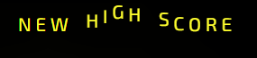

# Space Invaders

## Introduction

The modern adaptation of Space Invaders, with its innovative twist of featuring aliens with varying projectiles, reimagines a timeless classic for a new generation of gamers. By preserving the nostalgia of the original while injecting fresh elements, this application offers an engaging and thrilling gaming experience. Its purpose is to bridge the gap between gaming history and contemporary entertainment, bringing the beloved 1978 arcade hit into the present day.

One of the key values this application provides to users is the opportunity to relive the magic of Space Invaders with a modern flair. The introduction of diverse alien projectiles deepens gameplay complexity, urging players to engage in proactive thinking, rapid thought-processing, and quick reaction speeds. This reinvented classic serves as a delightful reminder of the roots of video gaming while catering to the evolving tastes and expectations of today's gamers. Ultimately, the application offers both nostalgia and innovation, making it a must-play for fans of the original and a captivating experience for newcomers seeking retro-inspired gaming with a twist.

**Important note: The canvas elements within the application do not dynamically scale with browser resizing, limiting its compatibility to desktops and laptops. To ensure optimal gameplay and responsiveness, it is highly recommended to play the app in full-screen mode.**

You can play the game [here](https://sasantazayoni.github.io/space-invaders/).

## User Experience

### User stories

* As a user, I want to dive right into a new game without the need for navigating menus or adjusting settings.
* As a user, I aim to grasp the game's mechanics and controls seamlessly, without becoming overwhelmed by menu navigation.
* As a user, I want to view my highest score to set a target for future gameplay.
* As a user, I want to be able to reset my high score.
* As a user, I want to be able to toggle the sound on and off.
* As a user, I want to test my reflexes and shooting skills against waves of alien invaders, striving to master the game's mechanics.
* As a user, I seek progressively increasing difficulty levels as I advance in the game to provide a more challenging experience.
* As a user, I want a fun and easy-to-pick-up game that I can enjoy during short breaks.
* As a user, I want to experience nostalgia by reliving my childhood through the game.

### Design

#### Colour scheme

The chosen color palette for the Space Invaders game collectively creates a visually stimulating and nostalgic atmosphere. The dark background, deep indigo, vibrant magenta, bright yellow, and clean white all work together to immerse players in a cosmic battleground, enhancing gameplay and adding a touch of retro-inspired modernity to the gaming experience.

#### Typography

'Exo 2' is the font of choice in this application with a fallback of the font-stack 'Arial, Helvetica, sans-serif'. This was a deliberate decision to align with the game's dynamic and modern aesthetic. With its geometric letterforms and clean lines, Exo 2 effectively captures the energy and excitement that our game offers. Its legibility and versatility ensure that players can navigate effortlessly while being immersed in the vibrant experience we've crafted.

### Features

#### Current features

* On the main menu, the highest score is retrieved from the local storage and shown with a bouncing animation to catch the user's attention. If there is no high score, nothing displays:  

  

* On the main menu and in the game screen, there is a sound toggler which can be used to activate/disable the sound. These are kept in sync by accessing the session storage:  

   

* All buttons are either purple or yellow:  

  

* Buttons also hover a neon hover effect according to their colour:  

   

* The 'Reset high score' button interacts with the local storage to erase the high score, simultaneously removing it from the top left corner of the main menu. When clicked, this button triggers a destruction sound effect, creating the illusion of the high score being obliterated, accompanied by a subtle tilt effect on the button for added visual feedback.:  

  

* The "New game" button starts a new game when clicked:  

  

* The "Instructions" button opens an instructions modal when clicked:  

  
  

* There is an animated effect on the game title in the main menu for an additional aesthetic effect:  

  

* At the bottom of the page is a link to this github along the credits, with a themed hover effect on the github icon:  

  
  

* The main game screen opens when the "New game" button is clicked and looks like this:  

  

* When the ship is destroyed by an alien projectile, the game ends and a modal opens showing your current score. Within this menu is an option to play again via the "Play again" button or an option to return to the main menu via the "Main menu" button:  

  

* When the game ends the local storage is checked against the current score. If the current score is higher animated text appears saying "NEW HIGH SCORE":  

  

#### Future features

* Background music could be added, as suggested by one of the testers.
* Currently the difficulty of the game increases as the aliens get more fire power and spawn more frequently, the alien spawn patterns can be more variant to increase the difficulty in a more interesting way (for example, aliens could spawn from the right and left of the canvas).
* Extra lives can be added to the spaceship and a way to attain more lives.
* Alternate weapons, shields and power ups can be added into game for the spaceship.
* Mini bosses can be added into the game after each stage.
* More ranks of aliens can be added (i.e more powerful than the red aliens with more pressurising projectiles).
* A game difficulty can be implemented for those who are more casual gamers as well as for the skilled gamers.

