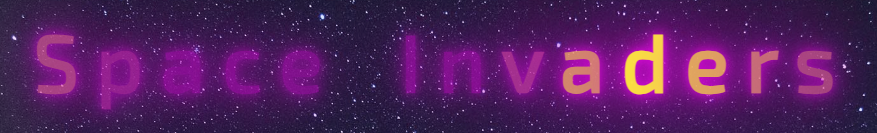

# Space Invaders

## Introduction

The modern adaptation of Space Invaders, with its innovative twist of featuring aliens with varying projectiles, reimagines a timeless classic for a new generation of gamers. By preserving the nostalgia of the original while injecting fresh elements, this application offers an engaging and thrilling gaming experience. Its purpose is to bridge the gap between gaming history and contemporary entertainment, bringing the beloved 1978 arcade hit into the present day.

One of the key values this application provides to users is the opportunity to relive the magic of Space Invaders with a modern flair. The introduction of diverse alien projectiles deepens gameplay complexity, urging players to engage in proactive thinking, rapid thought-processing, and quick reaction speeds. This reinvented classic serves as a delightful reminder of the roots of video gaming while catering to the evolving tastes and expectations of today's gamers. Ultimately, the application offers both nostalgia and innovation, making it a must-play for fans of the original and a captivating experience for newcomers seeking retro-inspired gaming with a twist.

**Important note: The canvas elements within the application do not dynamically scale with browser resizing, limiting its compatibility to desktops and laptops. To ensure optimal gameplay and responsiveness, it is highly recommended to play the app in full-screen mode.**

You can play the game [here](https://sasantazayoni.github.io/space-invaders/).

## User Experience

### User stories

* As a user, I want to dive right into a new game without the need for navigating menus or adjusting settings.
* As a user, I aim to grasp the game's mechanics and controls seamlessly, without becoming overwhelmed by menu navigation.
* As a user, I want to view my highest score to set a target for future gameplay.
* As a user, I want to be able to reset my high score.
* As a user, I want to be able to toggle the sound on and off.
* As a user, I want to test my reflexes and shooting skills against waves of alien invaders, striving to master the game's mechanics.
* As a user, I seek progressively increasing difficulty levels as I advance in the game to provide a more challenging experience.
* As a user, I want to experience nostalgia by reliving my childhood through the game.

### Design

#### Colour scheme

The chosen color palette for the Space Invaders game collectively creates a visually stimulating and nostalgic atmosphere. The dark background, deep indigo, vibrant magenta, bright yellow, and clean white all work together to immerse players in a cosmic battleground, enhancing gameplay and adding a touch of retro-inspired modernity to the gaming experience.

#### Typography

'Exo 2' is the font of choice in this application with a fallback of the font-stack 'Arial, Helvetica, sans-serif'. This was a deliberate decision to align with the game's dynamic and modern aesthetic. With its geometric letterforms and clean lines, Exo 2 effectively captures the energy and excitement that our game offers. Its legibility and versatility ensure that players can navigate effortlessly while being immersed in the vibrant experience we've crafted.

## Features

### Current features

* On the main menu, the highest score is retrieved from the local storage and shown with a bouncing animation to catch the user's attention. If there is no high score, nothing displays:  

  

* On the main menu and in the game screen, there is a sound toggler which can be used to activate/disable the sound. These are kept in sync by accessing the session storage:  

   

* All buttons are either purple or yellow:  

  

* Buttons also hover a neon hover effect according to their colour:  

   

* The 'Reset high score' button interacts with the local storage to erase the high score, simultaneously removing it from the top left corner of the main menu. When clicked, this button triggers a destruction sound effect, creating the illusion of the high score being obliterated, accompanied by a subtle tilt effect on the button for added visual feedback.:  

  

* The "New game" button starts a new game when clicked:  

  

* The "Instructions" button opens an instructions modal when clicked:  

  
  

* There is an animated effect on the game title in the main menu for an additional aesthetic effect:  

  

* At the bottom of the page is a link to this github along the credits, with a themed hover effect on the github icon:  

  
  

* The main game screen opens when the "New game" button is clicked and looks like this:  

  

* For every 100,000 points scored by the player, the difficulty increases which is signalled by the UI:  

  

* When the ship is destroyed by an alien projectile, the game ends and a modal opens showing your current score. Within this menu is an option to play again via the "Play again" button or an option to return to the main menu via the "Main menu" button:  

  

* When the game ends the local storage is checked against the current score. If the current score is higher animated text appears saying "NEW HIGH SCORE":  

  

### Future features

* Background music could be added, as suggested by one of the testers.
* Currently the difficulty of the game increases as the aliens get more fire power and spawn more frequently, the alien spawn patterns can be more variant to increase the difficulty in a more interesting way (for example, aliens could spawn from the right and left of the canvas).
* Extra lives can be added to the spaceship and a way to attain more lives.
* Alternate weapons, shields and power ups can be added into game for the spaceship.
* Mini bosses can be added into the game after each stage.
* More ranks of aliens can be added (i.e more powerful than the red aliens with more pressurising projectiles).
* A game difficulty can be implemented for those who are more casual gamers as well as for the skilled gamers.
* It could possible be made responsive (I am unsure of how to establish this).

## Technologies used

### Languages used

* HTML5
* CSS3
* JavaScript

### Frameworks, libraries and programs used

* [Font Awesome](https://fontawesome.com/) used for github icon and sound toggler.
* [Coolors](https://coolors.co/) used to display colour palette used on the website.
* [Google Fonts](https://fonts.google.com/) used to import 'Exo 2' font.
* [Github](https://github.com/) used to host repository.
* [Github pages](https://pages.github.com/) used to deploy the application.
* [VSCode](https://code.visualstudio.com/) used to develop project.
* [Lighthouse](https://developer.chrome.com/docs/lighthouse/overview/) used for performance review.
* [Caniuse](https://caniuse.com/) used to check compatibility of code syntax with other browsers.
* [PowerMapper](https://www.powermapper.com/) used to check compatibility of website with other browsers.
* [ChatGPT](https://chat.openai.com/) used to verify code and for problem-solving.
* [StackOverflow](https://stackoverflow.com/) used to problem solve and deal with queries.
* [Epidemicsound](https://www.epidemicsound.com/) used to obtain sound effects for the application.
* [Favicon.io](https://favicon.io/) used to generate favicon.
* [Unsplash](https://unsplash.com/) used to obtain background picture for the main menu.
* [Hiclipart.com](https://www.hiclipart.com/) used to obtain sprite for player spaceship.
* [Opensea.io](https://opensea.io/) used to obtain alien sprites.
* [Paint 3D](https://apps.microsoft.com/store/detail/paint-3d/9NBLGGH5FV99) used to establish a blank background for all sprites.
* [Youtube](https://www.youtube.com/watch?v=MCVU0w73uKI&t) used as a tutorial to understand concepts of collision and for the basis of building out this project.

## Testing

### Validator testing

I used the following websites to check my code for syntax errors:

* [HTML validator](https://validator.w3.org/)
* [CSS validator](https://jigsaw.w3.org/css-validator/)
* [JavaScript validator](https://jshint.com/)

### Testing User Stories from (UX) section

* As a user, I want to dive right into a new game without the need for navigating menus or adjusting settings.
  * The "New game" button on the main menu starts a new game and the "Play again" button on the end game modal can be clicked to start the game:  

   

* As a user, I aim to grasp the game's mechanics and controls seamlessly, without becoming overwhelmed by menu navigation.
  * There is a set of instructions which appears in the modal on the main menu which gives all the information about how the game works with key words highlighted for quick reference:  

  

* As a user, I want to view my highest score to set a target for future gameplay.
  * The high score appears on the top left of the main menu page with an eye-catching animation effect so that it is easy to spot:  

  

* As a user, I want to be able to reset my high score.
  * The "Reset high score" button on the top right of the main menu page can be clicked to reset the high score:  

  

* As a user, I want to be able to toggle the sound on and off.
  * The sound can be toggled on and off by clicking the sound icon on the main menu page and as well as the game screen:  

   

* As a user, I want to test my reflexes and shooting skills against waves of alien invaders, striving to master the game's mechanics.
  * When starting a game, the game consists of aliens which spawn and fire at the player sporadically. The user can exercise their reaction and information-processing skills:  

  
 
* As a user, I seek progressively increasing difficulty levels as I advance in the game to provide a more challenging experience.
  * When a stage is cleared, the progressively becomes more difficult with a higher chance of tougher enemies and an increased spawn rate:  
 
  

* As a user, I want to experience nostalgia by reliving my childhood through the game.
  * The game menu gives a retro-feel as well as the game itself:  

  
  

### Third-Party Testing

A great way to test is to get users to try the application and give feedback. Adjustments have been made according to the feedback given and the adjustments that were not made are documented in the future features section.

| Name | Comment |
| --- | --- |
| Joe | The gameplay viewed and responded seamlessly - I dont have a single point to note apart from it would be a great addition to make it mobile responsive. |
| Edna | My 1st impression of the home page was great. I loved the colors you picked. Then while playing, I felt a 100% flashback to the genuine 80's arcade games, I think you did a pretty good job! If I had to suggest something, it would be to include some background music. |
| Saba | It's fun but it's a little too easy, I can just destroy most of the aliens before they fire at me |
| Mark | Amazing game Sasan brought me back to my childhood, very nicely laid out, only one suggestion to slow down the lasers that the aliens fire down at you, the bullets are fine but the lasers travel way too fast to react to even from the start, maybe they can be that fast when the game levels. |
| Stefania | I liked it a lot, the sounds are cool and like the colours :smile: It gave me 80s vibes. Good job! |
| Nils | Good stuff - I get a little bit of flickering when I load the page once in the game it's running smooth, very cool! |
| Adam | Great stuff Sasan, only thing I noticed is when you press spacebar to shoot it scrolls the page down to the end. Other than that it's very very good! |
| Karolina | This is really cool Sasan! Very well done! One thing I noticed is when I hover over the buttons I see semi-transparent white stripes and I experience flickering across the screen. Seems to have something to do with the effect you have on the Space Invaders text? |

### Lighthouse testing

Lighthouse was a helpful tool for checking where where the web application was experiencing the most issues.

  

This application has received outstanding scores in key performance metrics, with an impressive 99 in performance and a perfect 100 in accessibility and SEO according to Google Lighthouse testing. These exceptional ratings reflect its commitment to providing a fast and accessible user experience while excelling in search engine optimization. Additionally, the high score of 92 in best practices showcases its dedication to adhering to industry standards and guidelines, further cementing its position as a top-notch and user-friendly application.

### PowerMapper Compatibility

  

As the results show, the application is highly compatible across all browsers.

### Bugs

* If the screen is resized during the game, it may delay the animate function which is constantly firing. This results in unusual behaviour such as aliens spawning in irregular patterns.
* If the console is open while the game is running, the game might stutter or slow down.
* Sometimes an alien projectile disappears before it reaches the bottom of the screen. This is to do with how projectiles are cleared from the array that they are passed into.

## Deployment

1. Log into [GitHub](https://github.com/).
2. Locate the [repository](https://github.com/SasanTazayoni/space-invaders).
3. Locate the settings option along the options bar at the top of the page.
4. Locate the 'Pages' option on the left side bar and click on it.
5. Under the 'Branch' subheading there should be a drop-down menu - select 'Master' from the branch options.
6. Click the save button.
7. Github pages will build your website with the code supplied and begin hosting it when it is completed - the process usually takes a few minutes.
8. The website URL will now be visible on the green bar under the section header. This will remain there permanently and you can refer back to it at any time.

## Credits

* Thanks to Edna, Stefania, Joe, Mark and Saba for thoroughly testing out my web application and giving useful suggestions.
* Thanks to [Chris Courses](https://www.youtube.com/@ChrisCourses) from YouTube for a tutorial on how to build this project.
* Thanks to Muhammed Irshad from [Online Tutorials](https://www.youtube.com/@OnlineTutorialsYT) from YouTube for all special effects and animations.
